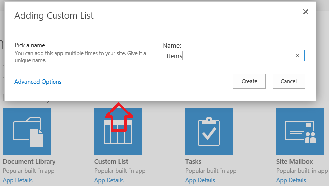
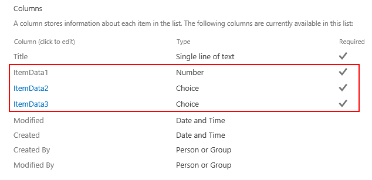
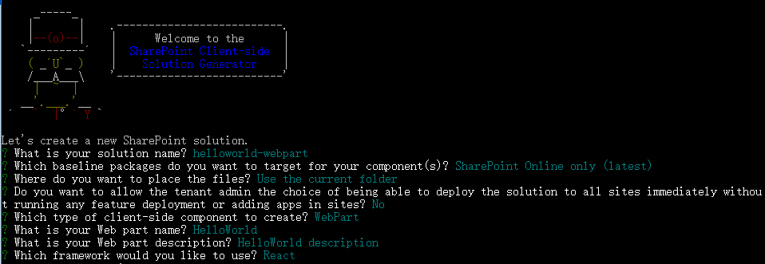
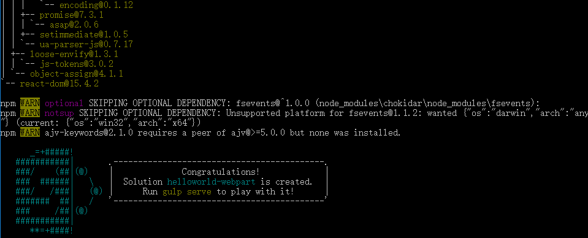
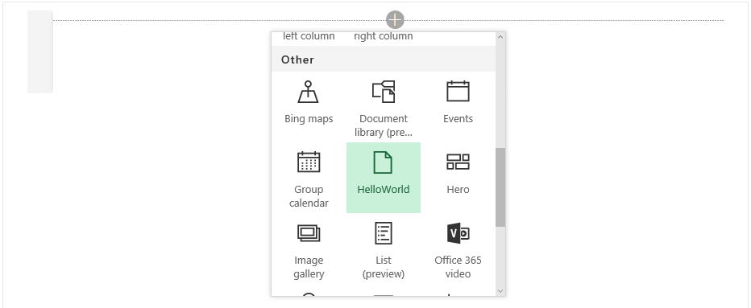
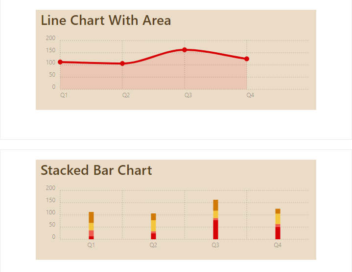
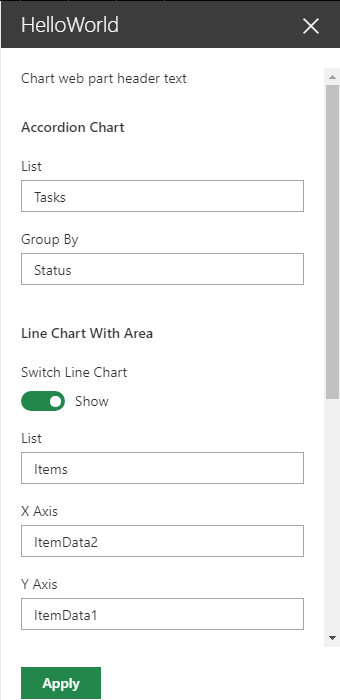

# Working with different JavaScript frameworks and libraries #
In this lab, you will use multiple JavaScript libraries (Chartist, Moment) to manipulate the SharePoint data and render it in charts.

## Prerequisites ##
Make sure you have completed the procedures in the following sections of [Getting Started with the SharePoint Framework (SPFx)](https://github.com/OfficeDev/TrainingContent/blob/master/SharePoint/SharePointFramework/01%20Getting%20Started%20with%20the%20SharePoint%20Framework/Lab.md) module: 
- [Setup development environment](https://github.com/OfficeDev/TrainingContent/blob/master/SharePoint/SharePointFramework/01%20Getting%20Started%20with%20the%20SharePoint%20Framework/Lab.md#setup-development-environment)
- [Setup Office 365 tenant](https://github.com/OfficeDev/TrainingContent/blob/master/SharePoint/SharePointFramework/01%20Getting%20Started%20with%20the%20SharePoint%20Framework/Lab.md##setup-office-365-tenant)


## Exercise 1: Use different JavaScript libraries (Chartist, Moment) and Office UI Fabric React components in a SPFx client-side web part ##

#### Table of Contents ####
- [Prerequisites](#prerequisites-1)
- [Create web part project](#create-web-part)
- [Install Chartist, Moment and PnP npm packages](#install-packages)
- [Unbundle external dependencies from web part bundle](#unbundle)
- [Create ChartistGraph component](#chartistgraph)
- [Create GroupedListExample component](#groupedlistexample)
- [Add ChartistGraph and GroupedListExample component to web part.](#add-component)
- [Configure Property Pane](#property-pane)
- [Retrieve SharePoint list data and bind to component](#retrieve-data)
- [Preview the web part in SharePoint](#preview)

#### <a name="prerequisites-1"></a>Prerequisites ####
Create two lists in your Office 365 developer tenant's developer site.

1. Go to your Office 365 developer tenant's developer site.

   > **Notes**:  If you followed the instructions in the [Getting Started with the SharePoint Framework (SPFx)](https://github.com/OfficeDev/TrainingContent/blob/master/SharePoint/SharePointFramework/01%20Getting%20Started%20with%20the%20SharePoint%20Framework/Lab.md) module, the developer site is located at **https://&lt;TENANCY&gt;.sharepoint.com/sites/dev**.  Replace the **&lt;TENANCY&gt;** placeholder with the name of your Office 365 Developer tenancy.
  
2. Create list **Tasks**. 
   1. Click the gear icon on the top nav bar on the right, then choose **Add an app** to go to the Apps page.

   2. Choose **Tasks**.

   3. In the popup window, enter **Tasks** in the name textbox and click **Create** button to create the list.

      
   
3. Create list **Items**.
   1. Click the gear icon on the top nav bar on the right, then choose **Add an app** to go to the Apps page.

   2. Choose **Custom List**.

   2. In the popup window, enter **Items** in the name textbox and click **Create** button to create the list.

      

   3. Click the gear icon on the top nav bar on the right, then choose **Site contents** to go to your Apps page, find the list **Items** in the library, right click on it and choose **Settings**.

   4. Move down to **Columns** section, choose **Create Column**.

   5. Enter **ItemData1** as the **Column name**, choose type **Number (1, 1.0, 100)**, and choose **Yes** for **Require that this column contains information:**.

   6. Click **OK** button at the bottom right corner to add this column to the list.

   7. Click **Create Column**.

   8. Enter **ItemData2** as the **Column name**, choose type **Choice (menu to choose from)**, and choose **Yes** for **Require that this column contains information**, type some choices separated by line you preferred.

   9. Click **OK**.

   10. Click **Create Column**.

   11. Enter **ItemData3** as the **Column name**, choose type **Choice (menu to choose from)**, and choose **Yes** for **Require that this column contains information**, type 'Q1','Q2', 'Q3', 'Q4', separated by line for choices.

   12. Click **OK**.

       

4. Add some items to **Tasks**.
   1. Choose the gear icon on the top nav bar on the right, then choose **Site Contents** to go to your Apps page.

   2. Find the list **Tasks**, click to access the all items page.
   
   3. Click **new tasks**.

   4. Enter a task name in the **Task Name** field.

   4. Choose a date for the **Start Date** field and another for **Due Date** field.

   5. Click **SHOW MORE** to show detail information.

   7. Select a value for the **Task Status** field.

   8. Click **Save** to create the task.

   9. Add more items by repeating step #3 - step #8. 

      >**IMPORTANT Note:** Make sure you create tasks with at least 2 different statuses. 

5. Add some items to **Items**..
   1. Choose the gear icon on the top nav bar on the right, then choose **Site Contents** to go to your Apps page.

   2. Find list **Items**, click to access the all items page.

   3. Click **New**.

   4. Type a title for **Title**.

   5. Type a number for **ItemData1**.

   6. Choose an option for **ItemData2**. 

   7. Choose an option for **ItemData3**.

   8. Choose **Save**.

   9. Repeat step #3 - step #8 to add some more items.

### <a name="create-web-part"></a> Create web part project ###

1. Open a console window, create a new project directory in your favorite location.

    `````shell
    md helloworld-webpart
    `````

2. Go to the project directory.

    ```shell
    cd helloworld-webpart
    ```

3. Create a new HelloWorld web part by running the Yeoman SharePoint Generator.

    ```shell
    yo @microsoft/sharepoint
    ```

4. When prompted
   - Accept the default **helloworld-webpart** as your solution name and choose **Enter**.
   - Choose **SharePoint Online only (latest)**, and press Enter.
   - Select **Use the current folder** for where to place the files.
   - Choose **N** to require the extension to be installed on each site explicitly when it's being used. 
   - Choose **WebPart** as the client-side component type to be created.  
   - Accept the default **HelloWorld** as your web part name and choose **Enter**.
   - Accept the default **HelloWorld description** as your web part description and choose **Enter**.
   - Choose **React** as the framework you would like to use and choose **Enter**.

     

5. When the scaffold is complete, you should see the following message indicating a successful scaffold:

   

6. Type below script to open the project in **Visual Studio Code**

    ```Shell
    code .
    ```

### <a name="install-packages"></a> Install **Chartist**, **Moment** and **PnP** npm packages

1. Press **Cmd/Ctl+`** to open **Integrated Terminal**, and locate at the **helloworld-webpart** directory.

2. Run the following to install **Chartist** npm package:

   ```shell
   npm install --save chartist
   ```

3. Run the following to install **Moment** npm package:

   ```shell
   npm install --save moment
   ```

4. Run the following to install **PnP** npm package:

   ```shell
   npm install --save sp-pnp-js
   ```

### <a name="unbundle"></a> Unbundle external dependencies from web part bundle

In Visual Studio Code, open the file *__config\config.json__*, add below modules to the **externals** section:

```JSON
    "chartist": "https://cdn.jsdelivr.net/chartist.js/latest/chartist.min.js",
    "moment": "https://cdnjs.cloudflare.com/ajax/libs/moment.js/2.19.1/moment.min.js"
```

>**Note:** Use the externals section contains the libraries that are not bundled with the default bundle. For module related CSS files, use **SPComponentLoader.loadCss** to load, will mentioned laster in this lab. 

Full content of the config.json file as currently as follows:

```JSON
{
  "$schema": "https://dev.office.com/json-schemas/spfx-build/config.2.0.schema.json",
  "version": "2.0",
  "bundles": {
    "hello-world-web-part": {
      "components": [
        {
          "entrypoint": "./lib/webparts/helloWorld/HelloWorldWebPart.js",
          "manifest": "./src/webparts/helloWorld/HelloWorldWebPart.manifest.json"
        }
      ]
    }
  },
  "externals": {
    "chartist": "https://cdn.jsdelivr.net/chartist.js/latest/chartist.min.js",
    "moment": "https://cdnjs.cloudflare.com/ajax/libs/moment.js/2.19.1/moment.min.js"
  },
  "localizedResources": {
    "HelloWorldWebPartStrings": "lib/webparts/helloWorld/loc/{locale}.js"
  }
}
```

### <a name="chartistgraph"></a> Create ChartistGraph component
1. Add a new file to the *__src/webparts/helloworld/components__* folder named **IChartistGraphProps.ts**, then add following code to it.

   ```TypeScript
   import * as Chartist from 'chartist';

   export interface IChartistGraphProps {
     type: 'Bar' | 'Line' | 'Pie';
     data?: Chartist.IChartistData;
     chartHeader?: string;
     className?: string;
     option?: Chartist.IPieChartOptions | Chartist.IBarChartOptions | Chartist.ILineChartOptions;
   }
   ```

   >**Note:** the **IChartistGraphProps** interface defines properties for the chartist component **ChartistGraph** below.
  
2. Add a new file to the *__src/webparts/helloworld/components__* folder named **ChartistGraph.tsx**, then add following code to it.

   ```TypeScript
   import * as React from 'react';
   import * as Chartist from 'chartist';
   import { IChartistGraphProps } from './IChartistGraphProps';

   export default class ChartistGraph extends React.Component<IChartistGraphProps, {}> {
     private _container: HTMLDivElement;
     private _chartist;
     public render() {
       return (
         <div className={this.props.className || ''}>
           <header>
             <h4>{this.props.chartHeader}</h4>
           </header>
           <div
             className='ct-chart'
             ref={el => this._container = el} />
         </div>);
     }
     public componentDidMount() {
       this.drawChart(this.props);
     }
     public componentDidUpdate() {
       this.drawChart(this.props);
     }
     private drawChart(config) {
       const { data, type, option, responsiveOptions } = config;
       if (this._chartist) {
         this._chartist.update(data, option, responsiveOptions);
       }
       else {
         this._chartist = new Chartist[type](this._container, data, option, responsiveOptions);
       }
     }
   }
   ```

   >**Note:** the function **drawChart** takes data and options from component's props, then initialize or update chart when props changed.

### <a name="groupedlistexample"></a> Create GroupedListExample component

1. Add a new file to the *__src/webparts/helloworld/components__* folder named **IGroupedListExampleProps.ts**, then add following code to it.

   ```TypeScript
   import { IGroup } from 'office-ui-fabric-react/lib/components/GroupedList/index';
   export interface IGroupedListExampleProps {
     items: any[];
     groups: IGroup[];
   }
   ```

   >**Note:** the interface **IGroupedListExampleProps** defines properties used in component **GroupedListExample** below.
   
2. Add a new file to the *__src/webparts/helloworld/components__* folder named **GroupedListExample.tsx**, then add following *import* statements to the top of the file .

   ```TypeScript
   import * as React from 'react';
   import {
     GroupedList,
     IGroup
   } from 'office-ui-fabric-react/lib/components/GroupedList/index';
   import { IColumn } from 'office-ui-fabric-react/lib/DetailsList';
   import { DetailsRow } from 'office-ui-fabric-react/lib/components/DetailsList/DetailsRow';
   import {
     FocusZone
   } from 'office-ui-fabric-react/lib/FocusZone';
   import {
     Selection,
     SelectionMode,
     SelectionZone
   } from 'office-ui-fabric-react/lib/utilities/selection/index';
   import { IGroupedListExampleProps } from './IGroupedListExampleProps';

   export default class GroupedListExample extends React.Component<IGroupedListExampleProps, any> {
     private _selection: Selection;

     constructor(props) {
       super(props);

       this._onRenderCell = this._onRenderCell.bind(this);
       this._selection = new Selection;
       this._selection.setItems(props.items || []);
     }

     public render() {
       if (this.props.items && this.props.groups) {
         return (
           <FocusZone>
             <SelectionZone
               selection={this._selection}
               selectionMode={SelectionMode.multiple}>
               <GroupedList
                 items={this.props.items}
                 onRenderCell={this._onRenderCell}
                 selection={this._selection}
                 selectionMode={SelectionMode.multiple}
                 groups={this.props.groups}/>
             </SelectionZone>
           </FocusZone>
         );
       }
       return null;
     }

     private _onRenderCell(nestingDepth: number, item: any, itemIndex: number) {
       let { _selection: selection } = this;
       return (
         <DetailsRow
           columns={
             Object.keys(item).slice(0, 3).map((value): IColumn => {
               return {
                 key: value,
                 name: value,
                 fieldName: value,
                 minWidth: 300
               };
             })
           }
           groupNestingDepth={nestingDepth}
           item={item}
           itemIndex={itemIndex}
           selection={selection}
           selectionMode={SelectionMode.multiple} />
       );
     }
   }
   ```

   >**Note:** the component **GroupedListExample** combines some office ui fabric react components, in the **render** function, wrap **GroupedList** with **FocusZone** and **SelectionZone** to make it focusable and selectable. **onRenderCell** returns a **DetailsRow** for each item passing into the component **GroupedListExample**.
   
### <a name="add-component"></a> Add ChartistGraph and GroupedListExample component to web part.

1. Replace the conent of *__src/webparts/helloworld/components/IHelloWorldProps.ts__* with following code:

   ```TypeScript
   import * as Chartist from 'chartist';
   import { IGroup } from 'office-ui-fabric-react/lib/components/GroupedList/index';

   export interface IParamConfiguration {
     CHART_WEB_PART_LOGO: string;
     CHART_WEB_PART_HEADER_TEXT: string;
     ACCORDION_TASK_HEADER_NAME?: string;
     ACCORDION_TASK_HEADER_STARTDATE?: string;
     ACCORDION_TASK_HEADER_DUEDATE?: string;
     ACCORDION_CHART_TITLE: string;
     ACCORDION_PIE_CHART_TITLE: string;
     LINE_CHART_TITLE: string;
     STACKED_BAR_CHART_TITLE: string;
   }

   export interface IHelloWorldProps {
     pieData?: Chartist.IChartistData;
     pieOption?: Chartist.IPieChartOptions;

     lineChartVisible?: boolean;
     lineData?: Chartist.IChartistData;
     lineOption?: Chartist.ILineChartOptions;

     stackedBarChartVisible?: boolean;
     barData?: Chartist.IChartistData;
     barOption?: Chartist.IBarChartOptions;

     groupItems?: any[];
     groupGroups?: IGroup[];

     paramConfiguration: IParamConfiguration;
     error: string[];
   }
   ```

   >**Note:** The interface **IParamConfiguration** defines properties what values are configurable in an external JSON file. While **IHelloWorldProps** defines properties used for component **HelloWorld** below.
   
2. Edit file *__src/webparts/helloworld/components/HelloWorld.module.scss__* to add below sections underneath **.button** class:
   ```SCSS
   .box {
     border: 1px solid #eaeaea;
     margin-bottom: 20px;
     padding-bottom: 40px;
     .small_box {
       border: 2px solid rgb(235, 220, 200);
       padding: 10px;
       margin-left: 5%;
       margin-right: 5%;
     }
     .accordion_header {
       text-align: center;
     }
     .accordion_area {
       text-align: center;
     }
     .chart_area {
       color:#5b4421;
       font-size: 1.77rem;
       font-weight: 400;
       background-color: rgb(235, 220, 200);
       width: 80%;
       margin:20px auto;
     }
     .accordion_header, .accordion_area, .chart_area{
       h4 {
         margin: 10px;
       }
     }
   }
   .errorContainer {
     color: red;
   }
   .webpart_logo {
     margin-top: -19px;
     img {
       float: left; 
       height: 40px;
       width: 40px;   
     }
     h2 {
       line-height: 40px;
       margin-left: 60px;
     }
   }
   ```

3. Replace the content of *__src/webparts/helloworld/components/HelloWorld.tsx__* with following code

   ```TypeScript
   import * as React from 'react';
   import styles from './HelloWorld.module.scss';
   import { IHelloWorldProps } from './IHelloWorldProps';
   import GroupedListExample from './GroupedListExample';
   import ChartistGraph from './ChartistGraph';
   import { SPComponentLoader } from '@microsoft/sp-loader';

   export default class HelloWorld extends React.Component<IHelloWorldProps, {}> {
     public componentDidMount(){
       SPComponentLoader.loadCss('//cdn.jsdelivr.net/chartist.js/latest/chartist.min.css');
     }
     public render(): React.ReactElement<IHelloWorldProps> {
       return (
         <div className={styles.helloWorld}>
           <div className={styles.errorContainer}>
             <ul>
               {this.props.error.map((e, i) => <li key={i}>{e}</li>)}
             </ul>
           </div>
           <div className={styles.box}>
             <div className={styles.webpart_logo}>
               <h2>{this.props.paramConfiguration.CHART_WEB_PART_HEADER_TEXT}</h2>
             </div>
             <div className={styles.small_box}>
               <header className={styles.accordion_header}>
                 <h4>{this.props.paramConfiguration.ACCORDION_CHART_TITLE}</h4>
               </header>
               <ChartistGraph type='Pie' data={this.props.pieData} option={this.props.pieOption} chartHeader={this.props.paramConfiguration.ACCORDION_PIE_CHART_TITLE} className={styles.accordion_area} />
               <GroupedListExample items={this.props.groupItems} groups={this.props.groupGroups} />
             </div>
           </div>
           {this.props.lineChartVisible ?
             <div className={styles.box}>
               <ChartistGraph type='Line' data={this.props.lineData} option={this.props.lineOption} chartHeader={this.props.paramConfiguration.LINE_CHART_TITLE} className={styles.chart_area} />
             </div > : <div />}
           {this.props.stackedBarChartVisible ?
             <div className={styles.box}>
               <ChartistGraph type='Bar' data={this.props.barData} option={this.props.barOption} chartHeader={this.props.paramConfiguration.STACKED_BAR_CHART_TITLE} className={styles.chart_area} />
             </div > : <div />}
         </div>
       );
     }
   }
   ```

   >**Note:** The render function takes charge of rendering a list of errors if any, and render a pie chart, a grouped list, a line chart and a stacked bar chart. Method **componentDidMount** uses **SPComponentLoader.loadCss** to load chartis styles from **jsdelivr** cdn.

### <a name="property-pane"></a> Configure Property Pane

1. Edit the file *__src/webparts/helloworld/loc/mystrings.d.ts__* to change interface **IHelloWorldWebPartStrings** as following:

   ```TypeScript
   declare interface IHelloWorldWebPartStrings {
     PropertyPaneDescription: string;
     BasicGroupName: string;
     DescriptionFieldLabel: string;

     LineChartGroupName: string;
     BarChartGroupName: string;

     accordionListNameLabel: string;
     accordionGroupByColumnLabel: string;

     lineChartVisibleLabel: string;
     lineChartListNameLabel: string;
     lineChartXAxisColumnLabel: string;
     lineChartYAxisColumnLabel: string;

     stackedBarChartVisibleLabel: string;
     stackedBarChartListNameLabel: string;
     stackedBarChartXAxisColumnLabel: string;
     stackedBarChartYAxisColumnLabel: string;
     stackedBarChartDataColumnLabel: string;
   }
   declare module 'HelloWorldWebPartStrings' {
     const strings: IHelloWorldWebPartStrings;
     export = strings;
   }
   ```

   >**Note:** This defines properties that applied to controls labels in property pane

2. Edit the file *__src/webparts/helloworld/loc/en-us.js__* to change the content as following. Each name/value pair maps a property defined in the interface **IHelloWorldWebPartStrings**:

   ```JS
   define([], function() {
     return {
       "PropertyPaneDescription": "Chart web part header text",
       "BasicGroupName": "Accordion Chart",
       "DescriptionFieldLabel": "Description Field",

       "LineChartGroupName": "Line Chart With Area",
       "BarChartGroupName": "Stacked Bart Chart",

       "accordionListNameLabel": "List",
       "accordionGroupByColumnLabel": "Group By",

       "lineChartVisibleLabel": "Switch Line Chart",
       "lineChartListNameLabel": "List",
       "lineChartXAxisColumnLabel": "X Axis",
       "lineChartYAxisColumnLabel": "Y Axis",

       "stackedBarChartVisibleLabel": "Switch Stacked Bar Chart",
       "stackedBarChartListNameLabel": "List",
       "stackedBarChartXAxisColumnLabel": "X Axis",
       "stackedBarChartYAxisColumnLabel": "Y Axis",
       "stackedBarChartDataColumnLabel": "Data"
     }
   });
   ```

2. Edit the file *__src/webparts/helloworld/HelloWorldWebPart.ts__* to change interface **IHelloWorldWebPartProps** as following:

   ```TypeScript
   export interface IHelloWorldWebPartProps {
     accordionListName: string;
     accordionGroupByColumn: string;

     lineChartVisible: boolean;
     lineChartListName?: string;
     lineChartXAxisColumn?: string;
     lineChartYAxisColumn?: string;

     stackedBarChartVisible: boolean;
     stackedBarChartListName?: string;
     stackedBarChartXAxisColumn?: string;
     stackedBarChartYAxisColumn?: string;
     stackedBarChartDataColumn?: string;
   }
   ```

3. Edit the file *__src/webparts/helloworld/HelloWorldWebPart.manifest.json__* to replace section **properties** of **preconfiguredEntries** with following:

   ```JSON
   "properties": {
     "accordionListName":"Tasks",
     "accordionGroupByColumn":"Status",
   
     "lineChartVisible": true,
     "lineChartListName":"Items",
     "lineChartXAxisColumn":"ItemData2",
     "lineChartYAxisColumn":"ItemData1",
   
     "stackedBarChartVisible":true,
     "stackedBarChartListName":"Items",
     "stackedBarChartXAxisColumn": "ItemData2",
     "stackedBarChartYAxisColumn":"ItemData1",
     "stackedBarChartDataColumn": "ItemData3"
   }
   ```

   >**Note:** These entries assign default values for properties used in property pane.

3. Continue to edit the file *__src/webparts/helloworld/HelloWorldWebPart.ts__* to replace the content of function **getPropertyPaneConfiguration** with following code:

```typescript
protected getPropertyPaneConfiguration(): IPropertyPaneConfiguration {
  return {
    pages: [
      {
        header: {
          description: strings.PropertyPaneDescription
        },
        groups: [
          {
            groupName: strings.BasicGroupName,
            groupFields: [
              PropertyPaneTextField('accordionListName', {
                label: strings.accordionListNameLabel,
                onGetErrorMessage: this.validatePropertyies.bind(this, true)
              }),
              PropertyPaneTextField('accordionGroupByColumn', {
                label: strings.accordionGroupByColumnLabel,
                onGetErrorMessage: this.validatePropertyies.bind(this, true)
              })]
          },
          {
            groupName: strings.LineChartGroupName,
            groupFields: [
              PropertyPaneToggle('lineChartVisible', {
                label: strings.lineChartVisibleLabel,
                onText: "Show",
                offText: "Hide"
              }),
              PropertyPaneTextField('lineChartListName', {
                label: strings.lineChartListNameLabel,
                onGetErrorMessage: this.validatePropertyies.bind(this, this.properties.lineChartVisible)
              }),
              PropertyPaneTextField('lineChartXAxisColumn', {
                label: strings.lineChartXAxisColumnLabel,
                onGetErrorMessage: this.validatePropertyies.bind(this, this.properties.lineChartVisible)
              }),
              PropertyPaneTextField('lineChartYAxisColumn', {
                label: strings.lineChartYAxisColumnLabel,
                onGetErrorMessage: this.validatePropertyies.bind(this, this.properties.lineChartVisible)
              })]
          },
          {
            groupName: strings.BarChartGroupName,
            groupFields: [
              PropertyPaneToggle('stackedBarChartVisible', {
                label: strings.stackedBarChartVisibleLabel,
                onText: "Show",
                offText: "Hide"
              }),
              PropertyPaneTextField('stackedBarChartListName', {
                label: strings.stackedBarChartListNameLabel,
                onGetErrorMessage: this.validatePropertyies.bind(this, this.properties.stackedBarChartVisible)
              }),
              PropertyPaneTextField('stackedBarChartXAxisColumn', {
                label: strings.stackedBarChartXAxisColumnLabel,
                onGetErrorMessage: this.validatePropertyies.bind(this, this.properties.stackedBarChartVisible)
              }),
              PropertyPaneTextField('stackedBarChartYAxisColumn', {
                label: strings.stackedBarChartYAxisColumnLabel,
                onGetErrorMessage: this.validatePropertyies.bind(this, this.properties.stackedBarChartVisible)
              }),
              PropertyPaneTextField('stackedBarChartDataColumn', {
                label: strings.stackedBarChartDataColumnLabel,
                onGetErrorMessage: this.validatePropertyies.bind(this, this.properties.stackedBarChartVisible)
              })
            ]
          }
        ]
      }
    ]
  };
}
``` 

  Import **PropertyPaneToggle** module

  ```TypeScript
  import {
    BaseClientSideWebPart,
    IPropertyPaneConfiguration,
    PropertyPaneTextField,
    PropertyPaneToggle
  } from '@microsoft/sp-webpart-base';
  ```

  > **Note:** This defines three groups in the property pane

4. Add the missing function to the end.

   ```TypeScript
   private validatePropertyies(visible: boolean, value: string): string {
     if (!visible || visible && value && value.length) {
       return '';
     }
     return 'Required';
   }
   ```

5. Add **get** method **disableReactivePropertyChanges** to enable non-reactive mode of the property pane, in this mode, an **Apply** button will show in the bottom of the property pane, and when clicked, will trigger **onAfterPropertyPaneChangesApplied** event.

   ```TypeScript
   protected get disableReactivePropertyChanges(): boolean {
     return true;
   }
   ``` 

### <a name="retrieve-data"></a> Retrieve SharePoint list data and bind to component
1. Add field **_thisData** to the start of class **HelloWorldWebPart** with some initial values, which holds data used for grouped list and charts. 

   ```TypeScript
   private _thisData: IHelloWorldProps = {
     lineOption: {
       low: 0,
       showArea: true
     },
     barOption: {
       stackBars: true
     },
     paramConfiguration: {
       CHART_WEB_PART_LOGO: '',
       CHART_WEB_PART_HEADER_TEXT: '',
       ACCORDION_TASK_HEADER_NAME: '',
       ACCORDION_TASK_HEADER_STARTDATE: '',
       ACCORDION_TASK_HEADER_DUEDATE: '',
       ACCORDION_CHART_TITLE: '',
       ACCORDION_PIE_CHART_TITLE: '',
       LINE_CHART_TITLE: '',
       STACKED_BAR_CHART_TITLE: ''
     },
     error: []
   };
   ```

2. Replace function **render** with following code to pass data as props to **HelloWorld** component

   ```TypeScript
   public render(): void {
     const element: React.ReactElement<IHelloWorldProps> = React.createElement(
       HelloWorld,
       {
         ...this._thisData
       }
     );

     ReactDom.render(element, this.domElement);
   }
   ```

3. Add field **paramConfigUrl** to holds the url of the customizations JSON file.

   ```TypeScript
   private readonly paramConfigUrl = 'https://o365parameterizedsamples.blob.core.windows.net/resources/customizations.json';
   ```
   The customizations JSON file stores predefined configuration values:
   ```JSON
   {
     "SharePoint": {
       "CHART_WEB_PART_LOGO": "https://o365parameterizedsamples.blob.core.windows.net/resources/images/logo.png",
       "CHART_WEB_PART_HEADER_TEXT": "Chart Web Part Header Text",
       "ACCORDION_TASK_HEADER_NAME": "Task Name",
       "ACCORDION_TASK_HEADER_STARTDATE": "Start Date",
       "ACCORDION_TASK_HEADER_DUEDATE": "Due Date",
       "ACCORDION_CHART_TITLE": "Existing Accordion Pie Chart",
       "ACCORDION_PIE_CHART_TITLE": "Pie Chart",
       "LINE_CHART_TITLE": "Line Chart With Area",
       "STACKED_BAR_CHART_TITLE": "Stacked Bar Chart"
     }
   }
   ```

4. Add below import statemen to import **HttpClient** and **HttpClientConfiguration** modules.

   ```TypeScript
   import { HttpClient, HttpClientConfiguration } from '@microsoft/sp-http';
   ```

   Add **_getParameters** to retrieve the customizations JSON file

   ```TypeScript
   private _getParameters(): Promise<any> {
     return this.context.httpClient.get(this.paramConfigUrl, HttpClient.configurations.v1).then((response) => {
       return response.json();
     });
   }
   ```

5. Import **pnp** and **moment** modules, one is used to connect to SharePoint list, the other for formating date.

   ```TypeScript
   import * as moment from 'moment';
   import pnp from 'sp-pnp-js';
   ```

   Add **_getData** method to get SharePoint list data depending on inputs from configuring property pane.

   ```TypeScript
   private _getData() {
     this.context.statusRenderer.displayLoadingIndicator(this.domElement, 'data');
     this._thisData.error.length = 0;
     this._thisData.lineChartVisible = this.properties.lineChartVisible;
     this._thisData.stackedBarChartVisible = this.properties.stackedBarChartVisible;

     let generateErrorForMissingFields = (response: any[], listName: string, fields: string[]) => {
     if (response.length) {
       var columns = Object.keys(response[0]);
       fields.forEach(f => {
       if (columns.indexOf(f) === -1) {
         this._thisData.error.push(`List '${listName}' does not have field named '${f}'`);
       }
       });
     }
     };
     let generateListError = (reason, listName) => {
     if (reason.status === 404) {
       this._thisData.error.push(`'${listName}' does not exist`);
     }
     else {
       this._thisData.error.push(`Failed to retrieve data from list '${listName}'`);
     }
     };

     let batch = pnp.sp.createBatch();

     //#region pie chart and grouped list
     if (this.properties.accordionListName && this.properties.accordionGroupByColumn) {
     pnp.sp.web.lists.getByTitle(this.properties.accordionListName).items.inBatch(batch).get()
       .then((response: any[]) => {
       generateErrorForMissingFields(response,
         this.properties.accordionListName,
         ['Title', 'StartDate', 'DueDate', this.properties.accordionGroupByColumn]);

       const groupedItems = {};
       for (const item of response) {
         if (!groupedItems[item[this.properties.accordionGroupByColumn]]) {
         groupedItems[item[this.properties.accordionGroupByColumn]] = [];
         }
         groupedItems[item[this.properties.accordionGroupByColumn]].push(item);
       }

       let pData = {
         labels: [],
         series: []
       };
       //#region sample data
       // const pieData = {
       //   labels:['In Progress','Completed','Not Started'],
       //   series: [5, 3, 4]
       // }
       //#endregion sample data
       let gData = {
         items: [],
         groups: []
       };
       //#region sample data
       // const groupData = {
       //   items: [
       //     {
       //       Title: 'Task1',
       //       StartDate: '02/02/2017',
       //       DueData: '08/02/2017'
       //     },
       //     {
       //       Title: 'Task2',
       //       StartDate: '02/02/2017',
       //       DueData: '08/02/2017'
       //     },
       //     {
       //       Title: 'Task3',
       //       StartDate: '02/02/2017',
       //       DueData: '08/02/2017'
       //     },
       //   ],
       //   groups: [
       //     { key: 'inprogress', count: 1, name: 'inprogress', startIndex: 0 },
       //     { key: 'deferred', count: 1, name: 'deferred', startIndex: 1 },
       //     { key: 'completed', count: 1, name: 'completed', startIndex: 2 }
       //   ]
       // };
       //#endregion sample data

       let index: number = 0;
       for (const item in groupedItems) {
         pData.labels.push(item);
         pData.series.push(groupedItems[item].length);

         gData.groups.push({
         key: item, count: groupedItems[item].length, name: item, startIndex: index, isCollapsed: index !== 0
         });
         groupedItems[item].forEach((v) => {
         gData.items.push({
           Title: v.Title,
           StartDate: moment(v.StartDate).format('MM/DD/YYYY'),
           DueDate: moment(v.DueDate).format('MM/DD/YYYY')
         });
         });
         index += groupedItems[item].length;
       }
       this._thisData.pieData = pData;
       this._thisData.groupItems = gData.items;
       this._thisData.groupGroups = gData.groups;
       })
       .catch(reason => generateListError(reason, this.properties.accordionListName));
     }
     //#endregion pie chart and grouped list

     //#region line chart
     if (this.properties.lineChartVisible && this.properties.lineChartXAxisColumn && this.properties.lineChartYAxisColumn) {
     pnp.sp.web.lists.getByTitle(this.properties.lineChartListName).items.inBatch(batch).get()
       .then((response: any[]) => {
       generateErrorForMissingFields(response,
         this.properties.lineChartListName,
         [this.properties.lineChartXAxisColumn, this.properties.lineChartYAxisColumn]);

       let data = {
         labels: [],
         series: [[]]
       };
       //#region sample data
       // const lineData = {
       //   labels: ['Q1', 'Q2', 'Q3', 'Q4'],
       //   series: [
       //     [5, 9, 7, 8]
       //   ]
       // };
       //#endregion sample data
       for (const item of response) {
         let index = data.labels.indexOf(item[this.properties.lineChartXAxisColumn]);
         if (index === -1) {
         data.labels.push(item[this.properties.lineChartXAxisColumn]);
         data.series[0].push(item[this.properties.lineChartYAxisColumn]);
         }
         else {
         data.series[0][index] += item[this.properties.lineChartYAxisColumn];
         }
       }
       this._thisData.lineData = data;
       })
       .catch(reason => generateListError(reason, this.properties.lineChartListName));
     }
     //#endregion line chart

     //#region stacked bar chart
     if (this.properties.stackedBarChartVisible && this.properties.stackedBarChartXAxisColumn && this.properties.stackedBarChartYAxisColumn && this.properties.stackedBarChartDataColumn) {
     pnp.sp.web.lists.getByTitle(this.properties.stackedBarChartListName).items.inBatch(batch).get()
       .then((response: any[]) => {
       generateErrorForMissingFields(response,
         this.properties.stackedBarChartDataColumn,
         [this.properties.stackedBarChartDataColumn, this.properties.stackedBarChartXAxisColumn, this.properties.stackedBarChartYAxisColumn]);

       let data = {
         labels: [],
         series: []
       };
       //#region sample data
       // const barData = {
       //   labels: ['Q1', 'Q2', 'Q3', 'Q4'],
       //   series: [
       //     [80, 120, 140, 130], //stack 1
       //     [20, 40, 50, 30],    //stack 2
       //     [10, 20, 40, 60]     //stack 3
       //   ]
       // };
       //#endregion sample data
       let stacks = [];
       for (const item of response) {
         let stackIndex = stacks.indexOf(item[this.properties.stackedBarChartDataColumn]);
         if (stackIndex === -1) {
         stacks.push(item[this.properties.stackedBarChartDataColumn]);
         data.series.push(data.labels.length ? data.labels.map(v => { return 0; }) : []);
         stackIndex = data.series.length - 1;
         }

         let labelIndex = data.labels.indexOf(item[this.properties.stackedBarChartXAxisColumn]);
         if (labelIndex === -1) {
         data.labels.push(item[this.properties.stackedBarChartXAxisColumn]);

         data.series.forEach((v, i) => {
           v.push(i === stackIndex ? item[this.properties.stackedBarChartYAxisColumn] : 0);
         });
         }
         else {
         data.series[stackIndex][labelIndex] += item[this.properties.stackedBarChartYAxisColumn];
         }
       }
       this._thisData.barData = data;
       })
       .catch(reason => generateListError(reason, this.properties.stackedBarChartListName));
     }
     //#endregion stacked bar chart

     batch.execute().then(() => {
     this.context.statusRenderer.clearLoadingIndicator(this.domElement);
     this.render();
     });
   }
   ```

   >**Note:** This method create a batch requests to get data from three SharePoint lists, and handle data properly so that it can be used to assign components' props. And when all requests completed, call **this.render()** to update related components 

6. Add method **onAfterPropertyPaneChangesApplied** as following, it will be called when user click **Apply** button on property pane.

   ```typescript
   protected onAfterPropertyPaneChangesApplied() {
       this._getData();
   }
   ```

8. Import **IParamConfiguration** module

   ```TypeScript
   import { IHelloWorldProps, IParamConfiguration} from './components/IHelloWorldProps';
   ```

8. Add method **onInit** as following, it first calls **_getParameters** to get configurations, then calls **_getData** to get SharePoint list data.

   ```TypeScript
   protected onInit(): Promise<void> {
       this._getParameters().then(response => {
         this._thisData.paramConfiguration = response['SharePoint'] as IParamConfiguration;
       }).then(() => {
         this._getData();
       });
       return super.onInit();
   }
   ```

9. Save the file and other previously edited files.

### <a name="preview"></a> Preview the web part in SharePoint
1. Press Cmd/Ctrl+` to open an Integrated Terminal.  

   

2. Run below command to install the developer certificate for use with SPFx development.

   ```Shell
   gulp trust-dev-cert
   ```

3. Run below command to build and preview your web part.

   ````Shell
   gulp serve
   ````

   This command will execute a series of gulp tasks to create a local, Node-based HTTPS server on 'localhost:4321' and launch your default browser to preview web parts from your local dev environment at https://localhost:4321/temp/workbench.html.

   >**Note:** SharePoint Workbench is also hosted in SharePoint to preview and test your local web parts in development. The key advantage is that now you are running in SharePoint context and that you will be able to interact with SharePoint data.

4. In the browser, go to the following URL: **https://your-sharepoint-site/_layouts/workbench.aspx**.

   >**Note:** If you followed the instructions in the [Getting Started with the SharePoint Framework (SPFx)](https://github.com/OfficeDev/TrainingContent/blob/master/SharePoint/SharePointFramework/01%20Getting%20Started%20with%20the%20SharePoint%20Framework/Lab.md) module, the workbench page is located at **https://&lt;TENANCY&gt;.sharepoint.com/sites/dev/_layouts/workbench.aspx**.  Replace the **&lt;TENANCY&gt;** placeholder with the name of your Office 365 Developer tenancy.

4. Click add button to add **HelloWorld** webpart to the page

   

5. Click the left pencil icon to open property pane, make changes and click apply to view compoents updates.

   

   

    